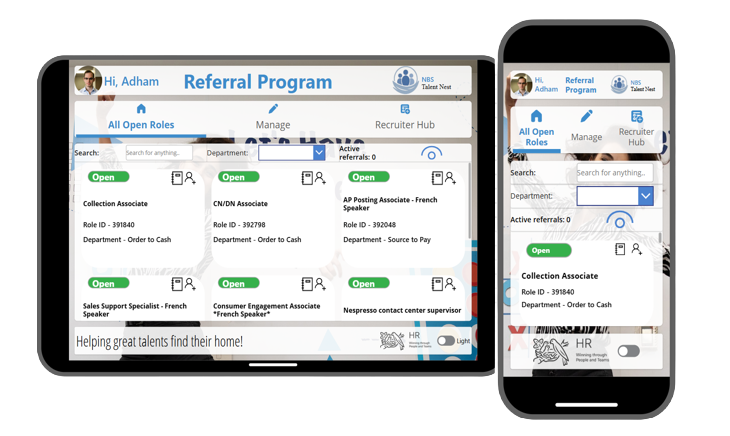
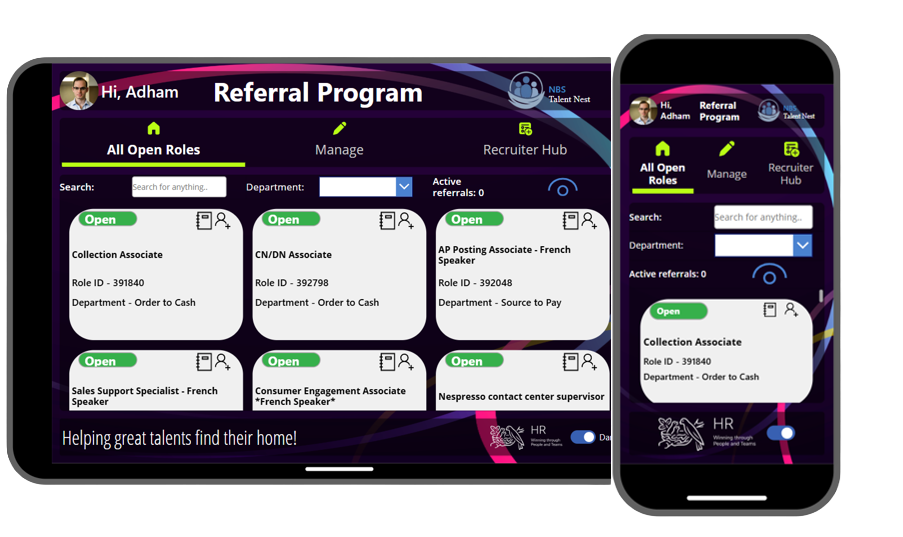
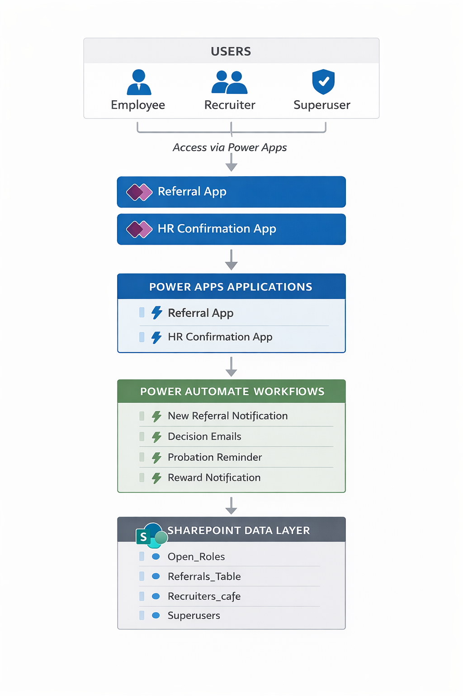
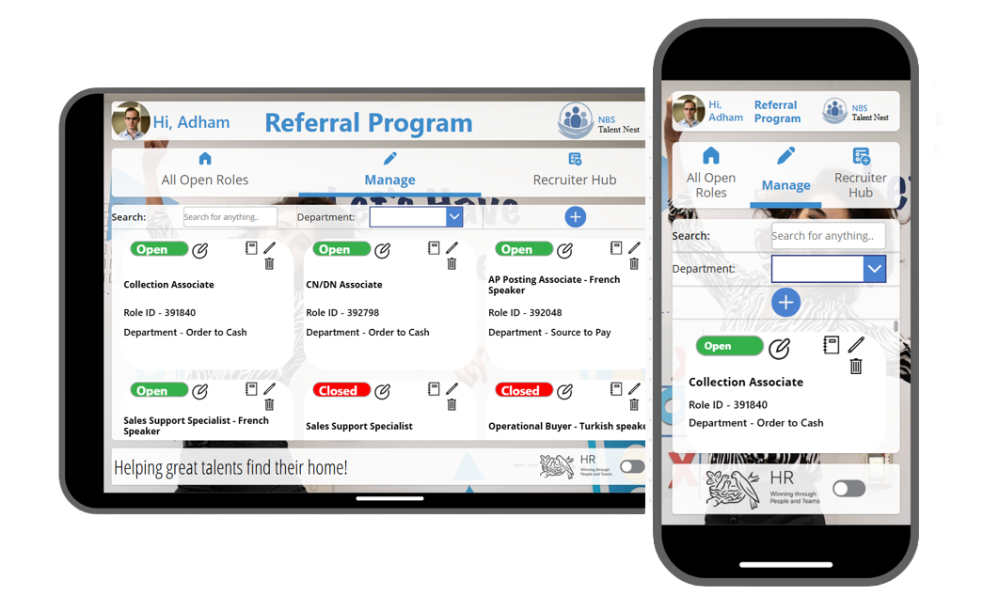
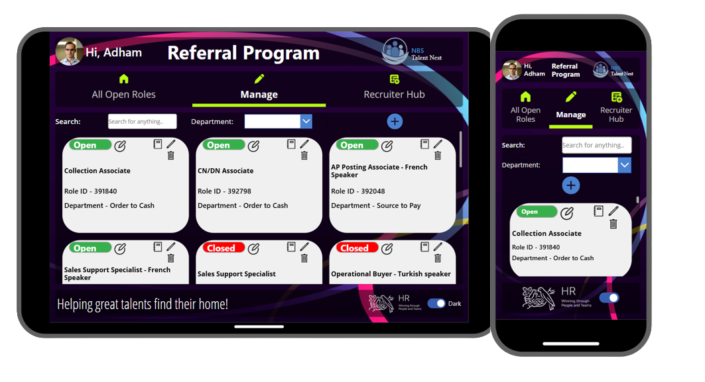
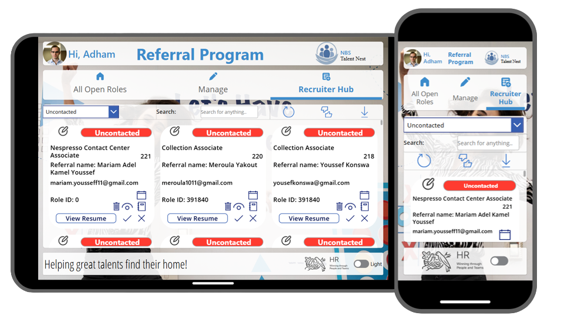
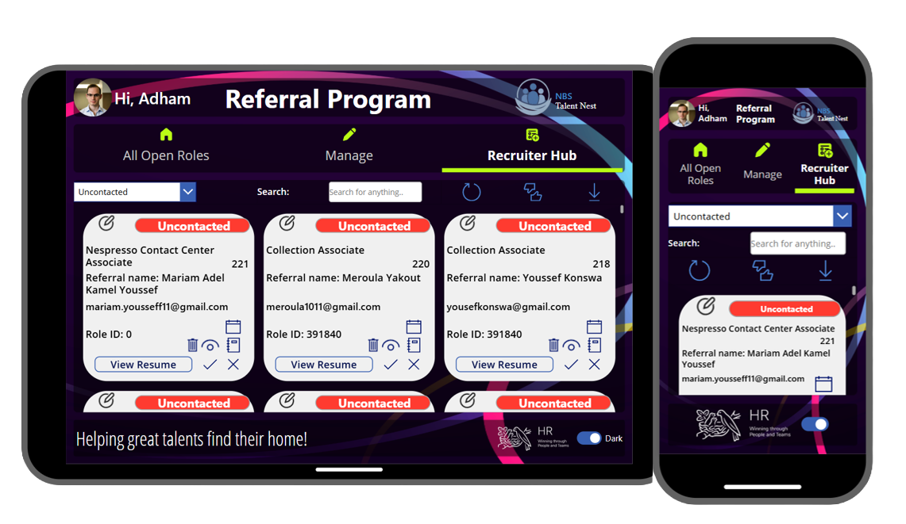
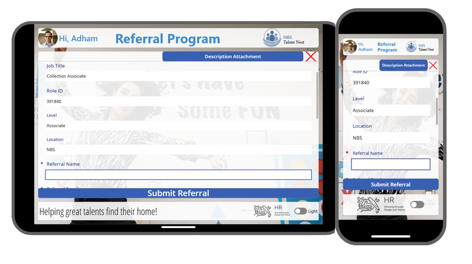
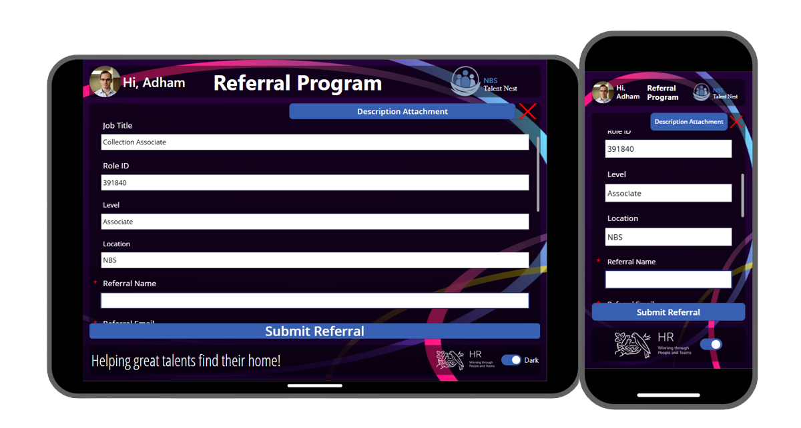
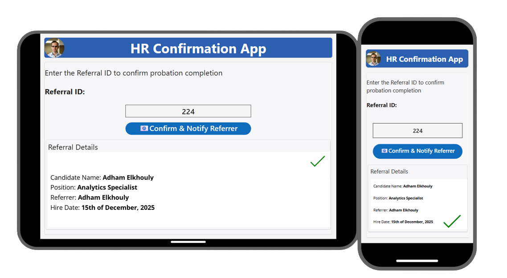

# Referral Management System (Power Platform)


A fully adaptive **Employee Referral Management System** built using **Microsoft Power Apps, SharePoint, and Power Automate**.

The system enables employees to refer candidates for open roles, allows recruiters and superusers to manage the referral pipeline, and automates the full lifecycle from submission to post-hire probation follow-up and reward notification.

This repository documents the architecture, UI, backend schema, permissions model, workflows, and deployment structure of the solution.

---

## All Open Roles Interface

<p align="center">
  
  
</p>

<p align="center"><em>Light Mode and Dark Mode views of the All Open Roles experience</em></p>

<p align="center">
Employees can browse open positions, search by keyword, filter by department, inspect role details, and submit referrals directly through the application.
</p>

---

## System Overview

The system manages the complete employee referral lifecycle:

1. Employees browse open roles
2. Employees submit referrals
3. Recruiters review candidates
4. Recruiters update referral status
5. If hired, a hire date is recorded
6. After three months, the system triggers a probation reminder
7. HR confirms probation completion through a companion app
8. The referrer is notified to claim their referral reward

The solution consists of two Power Apps applications:

- **Referral App** — the main application used by employees, recruiters, and superusers
- **HR Confirmation App** — a companion application used to confirm successful probation completion

---

## Key Capabilities

<p align="center">

🚀 <strong>Adaptive Interface</strong><br>
Works across desktop, tablet, and mobile with responsive layouts.

<br><br>

🌗 <strong>Light / Dark Mode</strong><br>
Supports dynamic theme switching for a modern user experience.

<br><br>

🔐 <strong>Role-Based Access Control</strong><br>
Employees, recruiters, and superusers each have tailored access and functionality.

<br><br>

⚙️ <strong>Automated Workflows</strong><br>
Power Automate handles notifications, hiring decisions, probation tracking, and reward communication.

<br><br>

📊 <strong>SharePoint-Backed Data Model</strong><br>
Uses structured SharePoint lists for postings, referrals, and access control.

<br><br>

🎯 <strong>End-to-End Referral Lifecycle</strong><br>
Covers the full workflow from role discovery to referral reward notification.

</p>

---

## System Architecture

<p align="center">
  
</p>

The architecture is organized into four layers:

### Users
- Employees
- Recruiters
- Superusers

### Application Layer
- Referral App (Power Apps)
- HR Confirmation App (Power Apps)

### Automation Layer
- Power Automate workflows for notifications and probation tracking

### Data Layer
- SharePoint lists used as the backend

---

## Core Features

### Browse Open Roles
Employees can browse available job postings using:

- keyword search
- department filtering
- role detail inspection
- direct referral submission

### Submit Referrals
Employees can submit candidate referrals directly through the application.

Submitted data includes:

- referral name
- referral email
- job title
- role ID
- level
- location
- referrer information
- supporting description

### Recruiter Hub
Recruiters and superusers can manage the referral pipeline by:

- browsing submitted referrals
- filtering by status
- updating candidate status
- adding recruiter feedback
- recording hire dates
- collaborating through comments

### Role Management
Superusers can manage job postings directly inside the app by:

- creating new postings
- editing existing postings
- toggling roles between open and closed
- deleting postings

### Workflow Automation
Power Automate workflows support:

- new referral notification
- decision notification
- probation reminder
- referral reward notification

### Probation Confirmation
The HR Confirmation App allows authorized users to:

- enter a referral number
- verify the referral state
- confirm probation completion
- trigger reward notification to the referrer

---

## Application Screenshots

## Manage Roles

<p align="center">
  
  
</p>

<p align="center"><em>Superusers can create, edit, close, reopen, and delete job postings</em></p>

---

## Recruiter Hub

<p align="center">
  
  
</p>

<p align="center"><em>Recruiters and superusers can manage referral review, status updates, hire dates, and internal comments</em></p>

---

## Referral Submission Form

<p align="center">
  
  
</p>

<p align="center"><em>Employees can submit candidate referrals directly through the application</em></p>

---

## HR Confirmation App

<p align="center">
  
</p>

<p align="center"><em>HR confirms whether a hired candidate has successfully completed the probation period, which triggers the referral reward notification</em></p>

---

## SharePoint Backend

The solution uses SharePoint as a lightweight backend for both application data and access control.

### Lists Used

| List | Purpose |
|---|---|
| `Open_Roles` | Stores job postings |
| `Referrals_Table` | Stores submitted referrals |
| `Recruiters_cafe` | Stores recruiter email addresses |
| `Superusers` | Stores superuser email addresses |

Detailed schema documentation is available in:

```text
docs/sharepoint-schema.md
```

---

## Automation Workflows

The system uses **Power Automate** for event-driven workflow automation.

### Workflows Included

- New referral notification
- Referral decision notification
- Referrer acceptance notification
- Probation reminder after hire date
- Referral reward notification

Detailed workflow documentation is available in:

```text
docs/flows.md
```

---

## Permissions and Access Control

The system uses dynamic role-based access control based on the current user’s email address.

### Roles

| Role | Access |
|---|---|
| Employee | Browse roles and submit referrals |
| Recruiter | Access Recruiter Hub and manage referrals |
| Superuser | Full administrative and recruiter functionality |

Access is controlled through the following SharePoint lists:

- `Recruiters_cafe`
- `Superusers`

Detailed access documentation is available in:

```text
docs/permissions-and-access.md
```

---

## Deployment

The system can be recreated in another Microsoft 365 environment by:

1. creating the required SharePoint lists
2. importing both Power Apps applications
3. reconnecting data sources
4. recreating the Power Automate workflows
5. populating recruiter and superuser access lists

Detailed deployment instructions are available in:

```text
docs/deployment-guide.md
```

---

## Repository Structure

```text
referral-management-system
│
├── LICENSE
├── README.md
│
├── powerapps
│   ├── referral-app.msapp
│   └── hr-confirmation-app.msapp
│
├── docs
│   ├── sharepoint-schema.md
│   ├── flows.md
│   ├── permissions-and-access.md
│   └── deployment-guide.md
│
├── diagrams
│   └── system-architecture.png
│
└── screenshots
    ├── open-roles-light.png
    ├── open-roles-dark.png
    ├── manage-tab-light.png
    ├── manage-tab-dark.png
    ├── recruiter-hub-light.png
    ├── recruiter-hub-dark.png
    ├── referral-form-light.png
    ├── referral-form-dark.png
    └── hr-confirmation-app.png
```

---

## Technology Stack

- Microsoft Power Apps
- Microsoft Power Automate
- SharePoint Online
- Microsoft 365

---

## Security and Privacy

This repository contains only:

- application packages
- documentation
- architecture visuals
- sanitized screenshots

No confidential company data, internal URLs, or employee information are included.

---

## Documentation

Additional technical documentation is available in the `docs/` folder:

- `sharepoint-schema.md`
- `flows.md`
- `permissions-and-access.md`
- `deployment-guide.md`

---

## License

This project is licensed under the MIT License.

```text
See LICENSE file for details.
```

---

## 🧑‍💻 Author

**Adham Elkhouly**

- Analytics Specialist @ Nestlé
- Developed independently as part of an internal automation initiative to improve employee referral workflows using the Microsoft Power Platform.
